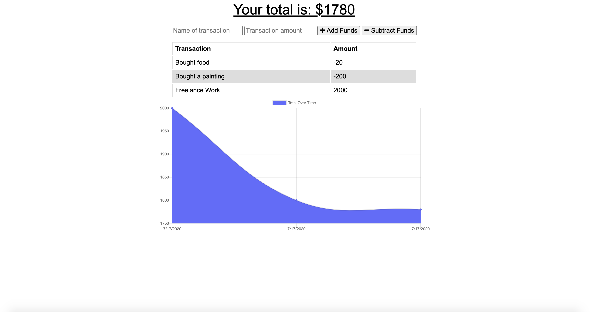

# Budget Tracker 

## Description 
This project is an application that allows users to add expenses and deposits to their budget with or without a connection. If the user enters transactions offline, the changes will be reflected when they're brought back online. This application uses IndexDB, Service workers, and Web Manifest for offline functionality and is deployed on Heroku. 

## Table of Contents
* [Installation](#installation)
* [Usage](#usage)
* [License](#license)
* [Contributing](#contributing)
* [Tests](#tests)
* [Questions](#questions)

## Installation 
The user should clone the repository from GitHub and install dependencies. To run server, run `npm start`. 

## Usage 
This application will allow users to create new transactions whether it's a deposit or withdraw, with or without internet connection. 
Please view deployed application on [Heroku](https://nw-budget-app.herokuapp.com/) 

## License 
This project is license under MIT

## Contributing 
Contributors should read the installation section. 

## Tests
There are no tests for this application. 

## Questions
If you have any questions about this projects, please contact me directly at nicole.elisaw@gmail.com. You can view more of my projects at https://github.com/nicolewallace09.